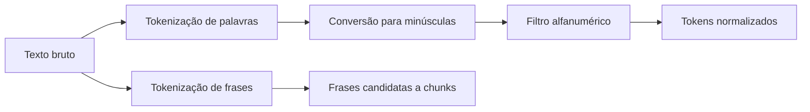
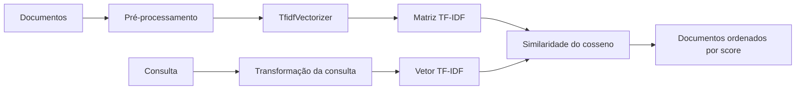
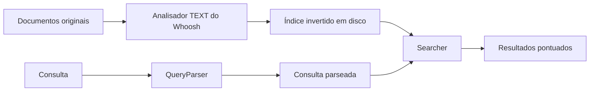
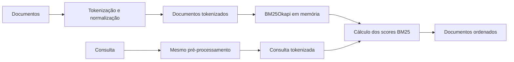
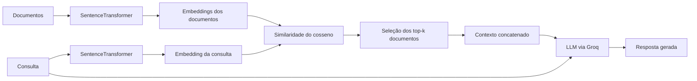

# Comparação das Técnicas de RAG

Este documento compara os arquivos:

- `src/fundamentals/tokenization-01.py`
- `src/fundamentals/tokenization-02.py`
- `src/fundamentals/tokenization-03.py`
- `src/fundamentals/tokenization-04.py`
- `rag.py`

## Visão geral

Os arquivos de `fundamentals` apresentam técnicas de pré-processamento e recuperação de informação. Apenas `rag.py` implementa o fluxo completo de **Retrieval-Augmented Generation (RAG)**, pois combina recuperação de documentos com geração de resposta por um modelo de linguagem.

| Arquivo | Técnica | Representação | Ranking | Geração de resposta |
|---|---|---|---|---|
| `tokenization-01.py` | Tokenização e normalização | Tokens de palavras e frases | Não se aplica | Não |
| `tokenization-02.py` | TF-IDF | Vetores esparsos de termos | Similaridade do cosseno | Não |
| `tokenization-03.py` | Busca com Whoosh | Índice invertido em disco | Pontuação do Whoosh | Não |
| `tokenization-04.py` | BM25 | Corpus lexical tokenizado | Score BM25 | Não |
| `rag.py` | Recuperação densa + RAG | Embeddings de frases | Similaridade do cosseno | Sim, via Groq |

## Diagramas dos pipelines

Os diagramas abaixo mostram o fluxo principal de cada técnica. Eles usam Mermaid, que é renderizado nativamente por algumas plataformas Markdown, como GitHub.

### Tokenização e normalização



### TF-IDF



### Whoosh e índice invertido



Neste exemplo, a função `preprocess()` personalizada não está conectada ao fluxo de indexação. Os documentos originais são enviados diretamente ao campo `content`.

### BM25



### RAG com embeddings



## 1. Tokenização: `tokenization-01.py`

Este arquivo apresenta a base de pré-processamento usada pelos outros exemplos. Ele não implementa uma técnica de recuperação.

- Usa `nltk.word_tokenize()` para separar palavras e símbolos.
- Usa `nltk.sent_tokenize()` para separar frases.
- Converte o texto para letras minúsculas.
- Tenta remover tokens que não são alfanuméricos.

Há um erro na linha 18:

```python
word.isalnum
```

O correto é:

```python
word.isalnum()
```

Sem os parênteses, o código verifica o método em vez de executar a verificação. Como o método é avaliado como verdadeiro, a pontuação não é removida.

A tokenização de frases também poderia ser usada como uma estratégia simples de divisão em chunks, mas isso não acontece neste arquivo.

## 2. TF-IDF: `tokenization-02.py`

O arquivo implementa recuperação lexical usando **TF-IDF** e similaridade do cosseno.

### Funcionamento

1. Os documentos são convertidos para minúsculas e tokenizados.
2. Tokens alfanuméricos são mantidos.
3. `TfidfVectorizer` transforma os documentos em vetores esparsos.
4. A consulta também é transformada em vetor.
5. Os documentos são ordenados pela similaridade do cosseno.

### Características

- Valoriza termos frequentes em um documento, mas raros no corpus.
- É simples e relativamente transparente.
- Funciona melhor quando os termos da consulta aparecem literalmente nos documentos.
- Não entende bem sinônimos, paráfrases ou equivalências semânticas.
- Não usa remoção de stopwords, stemming ou lematização.
- Retorna todos os documentos ordenados; o código apenas imprime os dez primeiros.

A consulta não passa explicitamente pela mesma função `preprocess()` usada nos documentos. Para a consulta atual, `machine learning`, isso não causa um problema relevante, mas consultas com pontuação, acentos ou tokens de um caractere podem ser tratadas de forma diferente.

TF-IDF poderia ser usado como o recuperador de um sistema RAG, mas neste arquivo não existe geração por LLM.

## 3. Whoosh: `tokenization-03.py`

Este arquivo implementa busca lexical com um **índice invertido** criado pelo Whoosh.

### Funcionamento

1. Cria o diretório `index_dir`.
2. Define um schema com título e conteúdo.
3. Indexa os documentos no campo `content`.
4. Usa `QueryParser` para interpretar a consulta.
5. Retorna os documentos encontrados pelo índice.

### Características

- Usa um índice persistido em disco durante a execução.
- É mais próximo de um mecanismo tradicional de busca do que de uma comparação manual de vetores.
- Permite sintaxe de consulta e operadores Booleanos.
- O código não configura explicitamente uma política estrita de `AND` ou `OR`.
- O Whoosh fornece sua própria pontuação para ordenar os resultados.
- A função retorna documentos, mas não retorna explicitamente os scores.

### Problemas no exemplo

A função `preprocess()` remove stopwords, mas seu resultado não é usado na indexação. Na linha 61, os documentos originais são enviados ao índice:

```python
writer.add_document(title=str(i), content=doc)
```

Consequentemente, a remoção personalizada de stopwords não afeta a busca. O Whoosh usa o analisador definido pelo seu próprio campo `TEXT`.

Além disso, `TfidfVectorizer` e `cosine_similarity` são importados, mas não são utilizados. O índice também é removido e recriado a cada execução.

Apesar do nome `boolean_search`, este exemplo é melhor descrito como busca lexical indexada com suporte a consultas Booleanas.

## 4. BM25: `tokenization-04.py`

O arquivo implementa recuperação lexical usando **BM25**, um método probabilístico muito usado em mecanismos de busca.

### Funcionamento

1. Tokeniza e normaliza todos os documentos.
2. Cria um objeto `BM25Okapi` com os documentos tokenizados.
3. Aplica exatamente o mesmo pré-processamento à consulta.
4. Calcula um score para cada documento.
5. Ordena os documentos do maior para o menor score.

### Características

- Considera a frequência dos termos.
- Aplica saturação à frequência: repetir muitas vezes o mesmo termo não aumenta indefinidamente a relevância.
- Considera o tamanho dos documentos.
- Geralmente é mais robusto que TF-IDF em corpora com documentos de tamanhos diferentes.
- Continua sendo lexical: depende da sobreposição de termos.
- Não possui geração de texto.
- Mantém os dados em memória e não cria um índice persistido como o Whoosh.

BM25 é uma escolha forte para recuperar documentos com termos exatos, nomes próprios, identificadores e palavras raras.

## 5. RAG denso: `rag.py`

Este é o único fluxo completo de RAG dos arquivos analisados.

### Etapas

1. O modelo `all-MiniLM-L6-v2` transforma os documentos em embeddings.
2. A consulta é transformada em outro embedding.
3. O código calcula a similaridade do cosseno entre a consulta e cada documento.
4. Os `top_k` documentos mais semelhantes são selecionados.
5. Esses documentos são concatenados como contexto.
6. O contexto e a pergunta são enviados ao modelo `openai/gpt-oss-120b` por meio da API da Groq.
7. O modelo gera a resposta final.

### Vantagens

- Recupera conteúdo semanticamente relacionado, mesmo quando as palavras não são idênticas.
- Pode relacionar paráfrases e conceitos próximos.
- Produz uma resposta em linguagem natural em vez de apenas listar documentos.
- Usa `temperature=0`, reduzindo a variação entre respostas.

### Limitações

- `all-MiniLM-L6-v2` é principalmente um modelo de embeddings em inglês, enquanto a consulta e a maior parte dos documentos estão em português. Um modelo multilíngue tende a ser mais adequado.
- Os embeddings são recalculados quando o arquivo é iniciado.
- A busca compara a consulta com todos os documentos em uma varredura linear.
- Não há banco vetorial, filtro por metadados, reranking, deduplicação ou busca híbrida.
- Os documentos são frases individuais; não existe uma estratégia geral de chunking.
- Os scores e identificadores das fontes não são enviados ao LLM.
- O prompt pede que o modelo use somente o contexto, mas não orienta explicitamente o modelo a informar quando o contexto não for suficiente.

## Comparação direta

| Critério | TF-IDF | Whoosh | BM25 | Embeddings em `rag.py` |
|---|---|---|---|---|
| Correspondência exata | Boa | Boa | Muito boa | Variável |
| Entendimento semântico | Baixo | Baixo | Baixo | Alto, se o modelo suportar o idioma |
| Sinônimos e paráfrases | Fraco | Fraco | Fraco | Bom |
| Termos raros e identificadores | Bom | Muito bom | Muito bom | Pode falhar |
| Indexação persistente | Não | Sim | Não | Não |
| Geração de resposta | Não | Não | Não | Sim |
| Complexidade de implementação | Baixa | Média | Baixa | Média |

## Conclusão

Os exemplos formam uma progressão didática:

1. Tokenização e normalização.
2. Recuperação esparsa com TF-IDF.
3. Busca lexical indexada com Whoosh.
4. Ranking lexical probabilístico com BM25.
5. Recuperação semântica com embeddings e geração por LLM.

A melhor solução prática não precisa escolher apenas uma técnica. Uma arquitetura híbrida pode combinar BM25 para termos exatos e embeddings para significado. Os resultados podem ser reranqueados antes de serem enviados ao LLM, aumentando a precisão do contexto e reduzindo respostas baseadas em documentos irrelevantes.
